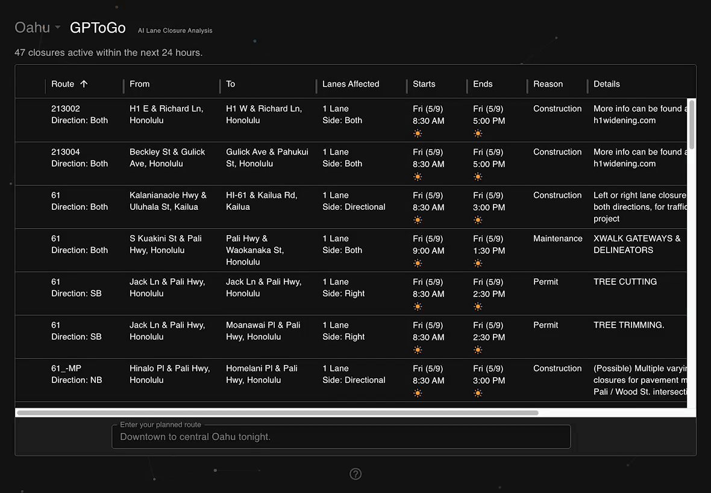

# Hawaii GPToGo - AI Lane Closure Analysis

A web application designed to fetch, display, and analyze lane closure information in the state of Hawaii.

[Live site](https://gptogo.app/)

## Overview

Hawaii GPToGo provides near real-time lane closure data sourced from the Hawaii Department of Transportation's [Lane Closure Public Access](https://hidot.hawaii.gov/highways/roadwork/) ArcGIS API.

Users can input their driving plan and receive an AI-generated analysis highlighting which closures might impact their route.

## Tech Stack

- **Frontend**: Next.js, React, TypeScript
- **UI**: Material UI (MUI)
- **Backend**: Supabase Edge Functions
- **AI**: Google Gemini
